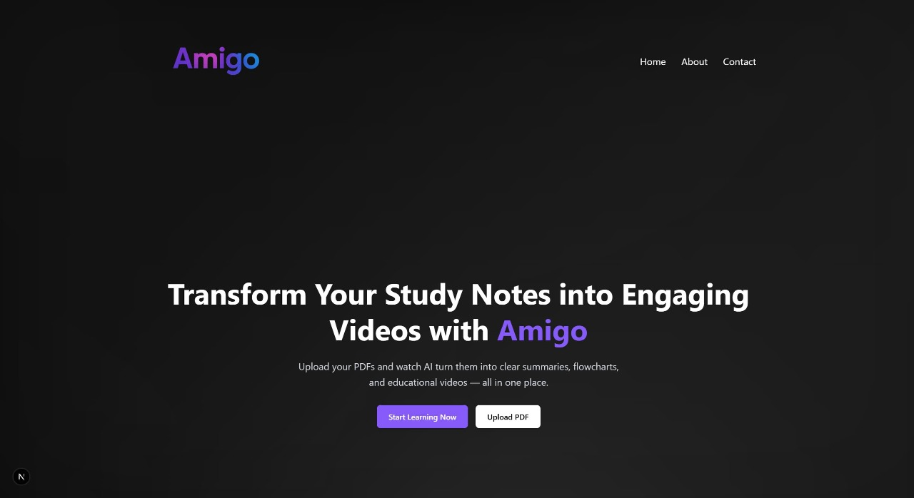

## AMIGO-AI

<p align="center">
  
</p>

A full-stack web application that lets users generate structured course outlines with AI. Users provide a topic, and the app creates a course structure, generates lesson content, and optionally builds flowcharts/visual diagrams—leveraging Google Generative AI and modern UI components.

Frontend: Built on Next.js & React, Tailwind, mermaid.js for diagrams.

Backend/DB: Serverless Postgres (NeonDB), drizzle ORM.

Features: Course/lesson generation, real-time updates, stylish UI.

## Features

- Automated Lesson & Content Generation: Each course includes AI-generated lesson titles, summaries, and detailed content to accelerate curriculum design.

- Visual Flowcharts with Mermaid: Converts course structure into interactive, auto-generated flowcharts for better visualization and planning.

- Persistent Storage: Save, load, and manage courses securely with a serverless PostgreSQL (NeonDB) backend and drizzle-ORM integration.

- Modern, Responsive UI: Enjoy a beautiful, intuitive interface built with Next.js, Tailwind (via shadcn/ui), and Radix UI components—optimized for all devices.

## Tech Stack

- **Frontend:** Next.js, Tailwind CSS,
- **Backend/API:** Python, Mermaid API, Gemini API, YouTube API
- **Database:** PostgreSQL (NeonDB, serverless), drizzle-ORM
- **AI Integration:** Google Generative AI APIs
- **Visualization:** Mermaid.js (for generating flowcharts/diagrams)

### Installation Guide

Follow these steps to set up and run your **AI Course Generator** locally and in development:

#### 1. **Clone the Repository**

```bash
git clone https://github.com/Sahil-SS/ai_course_generator.git
cd ai_course_generator
```

#### 2. **Install Dependencies**

```bash
npm install
```

#### 3. **Configure Environment Variables**

- Copy `.env.example` (or create a new file) and rename it to `.env.local`.
- Add your database connection string (PostgreSQL/NeonDB) and your Google Generative AI key and YouTube API key

```env
NEXT_PUBLIC_GEMINI_API_KEY
NEXT_PUBLIC_DATABASE_URL
NEXT_PUBLIC_YOUTUBE_API_KEY
NEXT_PUBLIC_HOST_NAME= http://localhost:3000/
```

- Update any other settings required by your drizzle/postgres config or AI API.

#### 4. **Set Up the Database**

- Use drizzle ORM commands to push your schema and open the database studio:

```bash
npm run db:push    # Sync schema to NeonDB/Postgres
npm run db:studio  # (Optional) Open visual DB browser
```

#### 5. **Start the Development Server**

```bash
npm run dev
```

- The app will be available at [http://localhost:3000](http://localhost:3000)

#### 6. **Access and Use the Application**

- Open your browser and navigate to `http://localhost:3000`
- Enter a topic to generate AI-powered course structure, lessons, and diagrams.

### 7. **Backend Setup (Python + Flask)**

- Enter the Backend Directory

```bash
cd backend
```

- Create a Python Virtual Environment

```python
python -m venv venv
source venv/bin/activate        # Mac/Linux
venv\Scripts\activate           # Windows
```

- Install Dependencies

```bash
pip install -r requirements.txt
# or manually:
pip install flask flask-cors PyPDF2 python-dotenv google-generativeai
```

- Set Environment Variables

```bash
GEMINI_API_KEY= "your_google_gemini_key"
```

- Run the Backend Server

```bash
python app.py
# Backend available at http://127.0.0.1:5000
```

### Usage Guide

These are the main ways users can interact with and benefit from your **AI Course Generator** site:

- **Instant Course Creation:**  
  Enter a topic or subject (e.g., "Introduction to Machine Learning") in the prompt box. The site generates a complete course outline with modules and lessons using AI.

- **AI-Generated Lesson Content:**  
  For each lesson, the AI generates summaries and detailed descriptions, helping educators or self-learners quickly scaffold new curricula.

- **Visualize with Flowcharts:**  
  View your course structure as an auto-generated flowchart or diagram (powered by Mermaid.js) to easily grasp the flow and hierarchy of lessons.

- **Save and Revisit Courses:**  
  Users can save generated courses to the database (PostgreSQL via NeonDB). Retrieve, edit, or continue working on previous courses from any device.

- **Responsive and Modern Interface:**  
  The UI adapts to desktops, tablets, and mobiles, providing a seamless experience for teachers, trainers, and EdTech teams.

##### Example Workflow

1. **Go to the home page.**
2. **Type a course topic** (“Digital Marketing Fundamentals”) and submit.
3. Review **AI-generated course outline & lessons**.
4. Examine the **flowchart** for the course structure.
5. **Save or export** your course for later use.
6. **Return or share** the link to continue editing or presenting the content.

### Future Upgrades

- **User Authentication & Profiles:**  
  Allow users to create accounts, save personal course libraries, and manage/retrieve their content from any device.

- **Collaboration Features:**  
  Let multiple users co-edit, comment, or review the same course for team-based curriculum design.

- **Export & Sharing Options:**  
  Support exporting courses and lessons as PDF, EPUB, SCORM, or plain Markdown for use in LMS platforms or offline.

- **Advanced AI Content:**  
  Enable generation of quizzes, homework, slides, and interactive exercises in each lesson. Integrate AI that can also suggest multimedia or open educational resources.

- **Customization & Templates:**  
  Offer instructors the ability to customize the course structure, lesson templates, or generation parameters (e.g., skill level, lesson count).

- **Localization & Multilingual AI:**  
  Translate course content into multiple languages on the fly to support global learners.

- **Analytics & Progress Tracking:**  
  Add dashboards for users to view course creation stats, engagement, or learner progress if the platform evolves to host learning directly.

- **Improved Flowchart & Visualization:**  
  Add drag-n-drop editing, nested diagrams, or downloadable image exports for the AI-generated flowcharts.

- **Mobile App Version:**  
  Create a companion mobile app for on-the-go course creation and review.

## Screenshots

<p align="center">
  <figure style="display: inline-block; text-align: center; margin: 0 10px;">
    
    <figcaption>Home Page</figcaption>
  </figure>
  <figure style="display: inline-block; text-align: center; margin: 0 10px;">
    
    <figcaption>Course Creation</figcaption>
  </figure>
  <figure style="display: inline-block; text-align: center; margin: 0 10px;">
    
    <figcaption>Generated Course</figcaption>
  </figure>
  <figure style="display: inline-block; text-align: center; margin: 0 10px;">
    
    <figcaption>Saved Courses</figcaption>
  </figure>
  <figure style="display: inline-block; text-align: center; margin: 0 10px;">
    
    <figcaption>PDF Summary</figcaption>
  </figure>
  <figure style="display: inline-block; text-align: center; margin: 0 10px;">
    
    <figcaption>Contact Us</figcaption>
  </figure>
</p>
